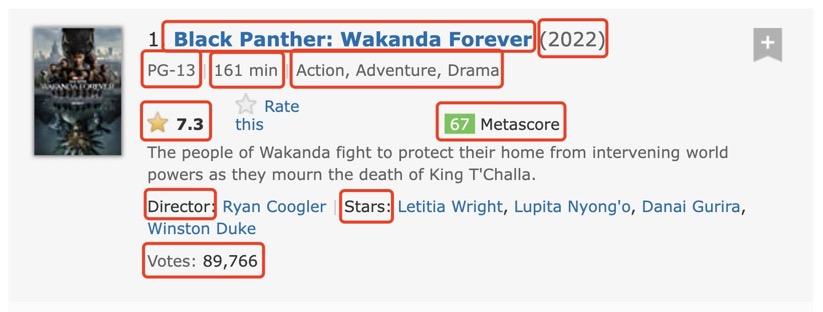
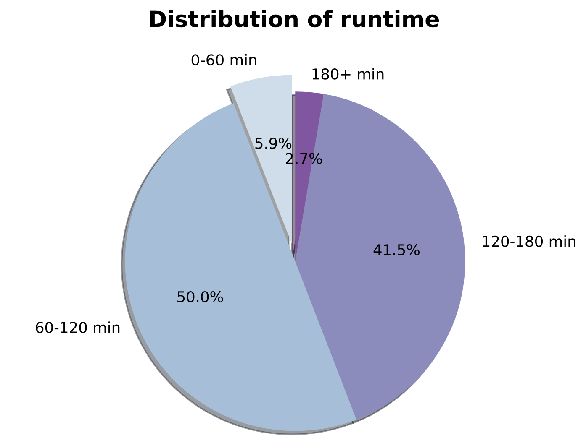
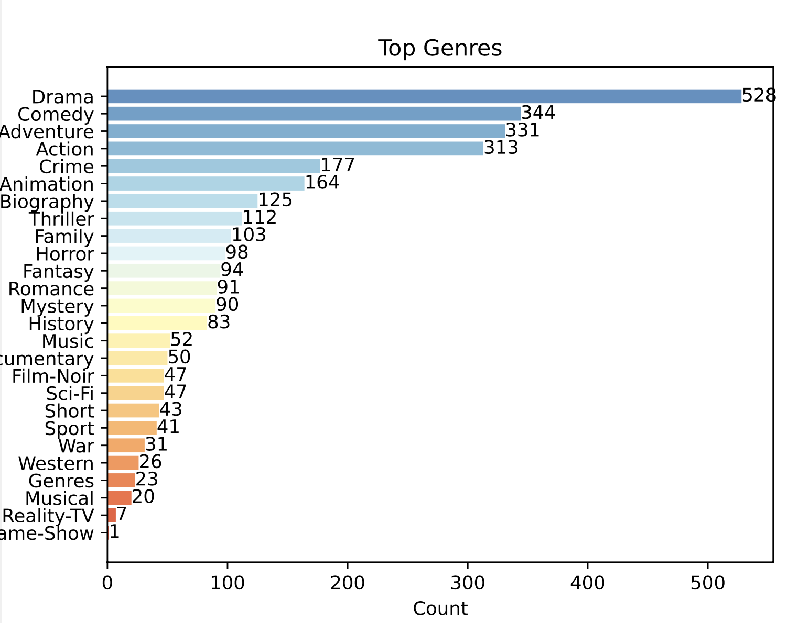
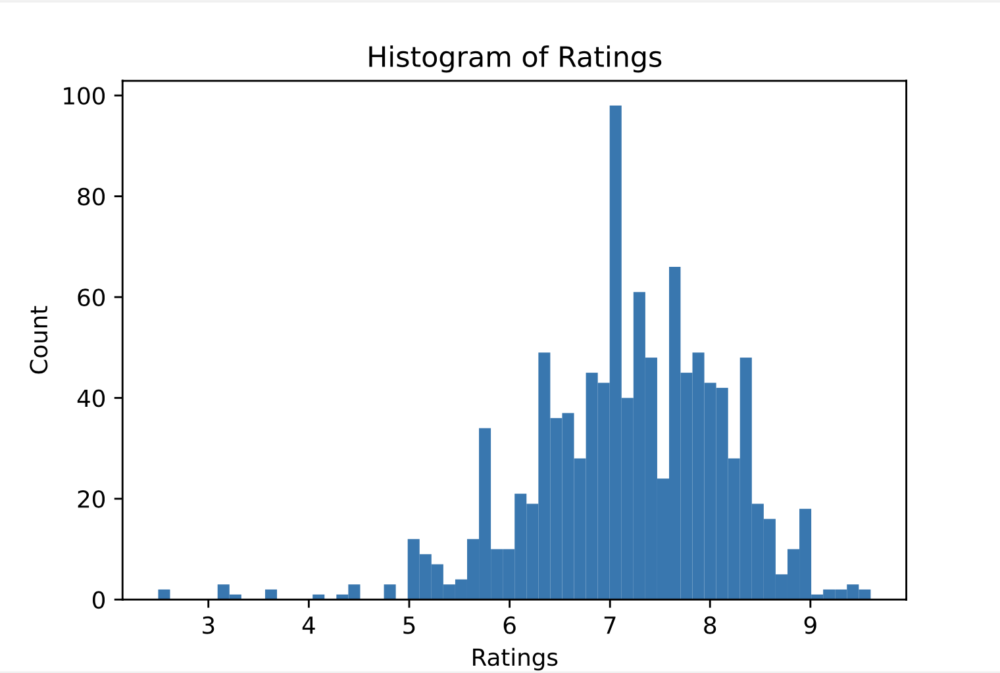

## Q1:What’s the name of your final project? Please describe it as a research question and provide a short description.
The project aims to analyze the top 50 movie data in each genre, with a total of about 24 genres and 1200 movies. Firstly, I wrote a Python script to obtain all movie categories in IMDb (https://www.imdb.com) through a web crawler method, and saved 24 genres of movies and corresponding website links as data sources. Secondly, I wrote another crawler method to crawl the movie data in each genre. The target data collection objects include title, year, directors, actors, genre, production country, language, duration, rating, number of comments, etc. Finally, by importing the `multiprocessing` package of Python, I have realized a multi-process crawler, so that movie data of various categories are crawled in parallel.
After getting the data form, the data is pre-processed, i.e., cleaned, de-duplicated and factorized to convert the data type. After some pre-processing, the final available data table is obtained, according to which we perform some data visualization, using a `bar chart` to display the popular genre of movies and using a histogram to show the rating distribution of top movies. Moreover, I have realized a data analysis script to obtain the distribution of movie runtime and used a `pie chart` to display the data results. As for the "Bonus" graph, I have achieved an interactive bar growth chart to show the change in the number of top movies in each genre from 1930 to 2022 through JavaScript and Python.

## Q2:How to run your code?

#### Project directory
```txt
├── code
│   ├── crawler.log             // crawler running log info
│   ├── crawler.py              // crawler script
│   ├── data_analysis.py        // data preprocess, analysis and visualization
│   └── sourceURL.json          // data source
├── data
│   ├── csv_data                // all movie data
│   ├── movies.csv              // The directory contains raw movie data of 24 genres
│   └── original_data           // The directory has saved original HTML movie data of 24 genres
├── readme.md
├── requirements.txt
└── result                      // data visualization figures
    ├── liveBar.html
    ├── liveBar.json
    ├── rq1.pdf
    ├── rq2.pdf
    └── rq3.pdf
```

**a. Please specify the dependency and version via requirements.txt.**
* The project uses some special libraries as shown in the `requirements.txt` which is generated by command `pipreqs .`.

**b. Please specify how to re-produce your result.**
**1. Obtain 24 genres of movie data sources.**
You can run `crawler.py` with the following commands.
    * `python3 crawler.py`
    * `nohup python3 crawler.py >./crawler.log 2>&1 &`
```python
    # crawler.py
    genreURL = "https://www.imdb.com/feature/genre/?ref_=nv_ch_gr"
    getGenres(genreURL)
```
The `sourceURL.json` contains data sources of 24 categories.

**2. Crawler movie data**
Run command: `python3 crawler.py`
```python
    # crawler.py
    crawler(" Action ", "https://www.imdb.com/search/title?genres=action&title_type=feature&explore=genres&pf_rd_m=A2FGELUUNOQJNL&pf_rd_p=facfbd0c-6f3d-4c05-9348-22eebd58852e&pf_rd_r=VCTZ4NX9C1E11S3GZ1CD&pf_rd_s=center-6&pf_rd_t=15051&pf_rd_i=genre&ref_=ft_gnr_mvpop_1")
    # multiprocesses run 
    main()
```
After the crawler runs, the movie data will be saved in the directory of `./data/csv_data`. 

**3. Data preprocess and visualization**
The code for data analysis and visualization can be seen in the script file `./code/data_analysis.py`. Run command `python3 ./code/data_analysis.py`. 

```python
if __name__ == '__main__':
    data_rq1 = analysis_rq1()
    plot_rq1(data_rq1, "/result/rq1.pdf")

    data_rq2 = analysis_rq2()
    plot_rq2(data_rq2, "/result/rq2.pdf")

    data_rq3 = analysis_rq3()
    plot_rq3(data_rq3, "/result/rq3.pdf")

    # save interactive bar growth data
    data_rq4 = analysis_rq4()
    with open("/result/liveBar.json",'w',encoding='utf-8') as fp:
        json.dump(data_rq4, fp,indent=4)

```
`analysis_rqx` methods are to preprocess and analyze data from different aspects. 
Output: structured data for easy visualization.
`plot_rqx` methods are to plot various graphs to show data analysis results.
Params:
* `data`: structured data from `analysis_rqx`
* `savename`: graph save path.

c. github repository: https://github.com/sherryli1116/dsci510-finalproject


## Q3:What data did you collect? How did you collect them? How many data samples did you collect?
I have crawled 24 genres of movie data as data source through the `getGenres` method in `./code/crawler.py`. The data source can be sorted as follows.
```txt
{
    " Action ": "https://www.imdb.com/search/title?genres=action&title_type=feature&explore=genres&pf_rd_m=A2FGELUUNOQJNL&pf_rd_p=facfbd0c-6f3d-4c05-9348-22eebd58852e&pf_rd_r=VCTZ4NX9C1E11S3GZ1CD&pf_rd_s=center-6&pf_rd_t=15051&pf_rd_i=genre&ref_=ft_gnr_mvpop_1",
    " Adventure ": "https://www.imdb.com/search/title?genres=adventure&title_type=feature&explore=genres&pf_rd_m=A2FGELUUNOQJNL&pf_rd_p=facfbd0c-6f3d-4c05-9348-22eebd58852e&pf_rd_r=VCTZ4NX9C1E11S3GZ1CD&pf_rd_s=center-6&pf_rd_t=15051&pf_rd_i=genre&ref_=ft_gnr_mvpop_2",
    " Animation ": "https://www.imdb.com/search/title?genres=animation&title_type=feature&explore=genres&pf_rd_m=A2FGELUUNOQJNL&pf_rd_p=facfbd0c-6f3d-4c05-9348-22eebd58852e&pf_rd_r=VCTZ4NX9C1E11S3GZ1CD&pf_rd_s=center-6&pf_rd_t=15051&pf_rd_i=genre&ref_=ft_gnr_mvpop_3",
    " Biography ": "...",
    " ... ": "..."
}
```
The movie data types in each data source website included are shown in the figure below.

Dataform as shown in the code.
```python
dataDict = {
    'Name':"Black Panther: Wakanda Forever",
    'Year':"2022",
    'Certificate':"PG-13",
    'Runtime':"160 min",
    'Genres':"Action, Adventure, Drama",
    'Director':"Ryan Coogler",
    'Stars': "Letitia Wright,Lupita Nyong'o,Danai Gurira,Winston Duke",
    'Ratings':"7.3",
    'Metascore':"67",
    'Votes': "89766"
}
```
I have used `request` to access the url of each genre and get the returned page source code. Then used `BeautifulSoup` library to parse and analyze the source code of the page. By locating some tag names such as `divs = soup.find_all('div',attrs={'class':'table-cell primary'})` to obtain the target data. When I use the same tag name to locate data elements, some movies do not have this tag because of the lack of corresponding data, which will cause the program to report an error, and the data crawling of this page will fail. To avoid such errors, I surround the code with `try ... catch ... ` when locating each element and getting the data value. 
After the above steps, this project crawled a total of 24 categories of movie data, each category containing the top 50 movies. After data preprocessing and file merging, there are a total of 1173 pieces of movie data saved in `./data/movies.csv`.

## Q4:What kind of analyses or visualizations did you do?

I have done 4 data analysis and visualization based on the movies data.
**1. Distribution of runtime**
I have divided the duration of the movie into the following four categories(`"0-60 min", "60-120 min","120-180 min","180+ min"`). Then use a for loop to traverse the duration of each movie in the dataset and recorded it, and finally expressed it using the pie chart of `matplotlib` library.

**Conclusion**: Among the popular movies in all categories, the number of movies with a duration of "60-120 min" is the largest, followed by the percentage of "120-180 min".

**2. Top genres data**
Each movie recorded in IMDB can belong to multiple categories. I have used code counts the multiple categories that all movies belong to, and arranges them in descending order according to the number of categories. Use a bar chart to display the data analysis results.

**Conclusion**: Among the top-ranked movie genres in recent years, the genre of Drama is the most popular among audiences, followed by the category of Comedy, Adventure and Action.

**3. Distribution of ratings**
I used a histogram to count the distribution of ratings for all popular movies in the dataset. First, use the `dropna` method to filter movies with empty ratings, and then use `plt.hist(data, bins=60, density = False)` to visualize the results.

**Conclusion**: Among the ratings of all popular movies, the number of movies with a score between 6 and 8 is the largest, especially the number of movies with a score near 7 is the largest.

**4. Interactive bar growth chart**
I used a histogram to count the distribution of ratings for all popular movies in the dataset. First, use the `dropna` method to filter movies with empty ratings, and then use `plt.hist(data, bins=60, density = False)` to visualize the results.

<video id="video" controls="" preload="none">
    <source id="mp4" src="./result/rq4.mp4" type="video/mp4">
</video>

**Conclusion**: This chart shows the change in the number of top movies in each genre from 1930 to 2022. It can be seen from the development and changes of the interactive chart that after the 20th century, the speed of new movies in each movie category became faster.

## Q5:Future work
The movie data crawled by this project only includes the ranking list of limited dates, so the year of the overall movie data set is relatively close to recent years. Future work can combine third-party data sources to supplement and crawl IMDB historical movie ranking list data. This allows for a more comprehensive data analysis. Moreover, this project did not deal with the missing data in some fields in the data analysis, but evaluated the amount of missing data in the field and ignored its impact. Future work could optimize for data handling of missing fields.
